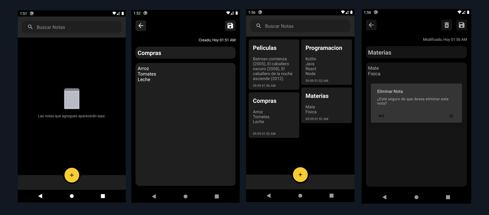
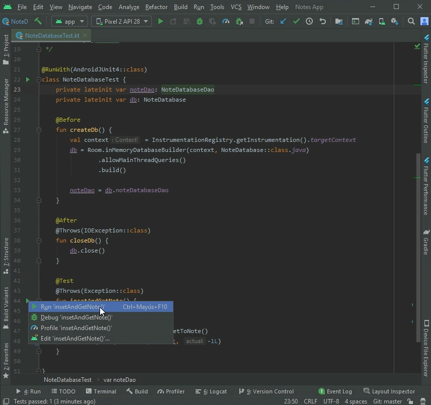
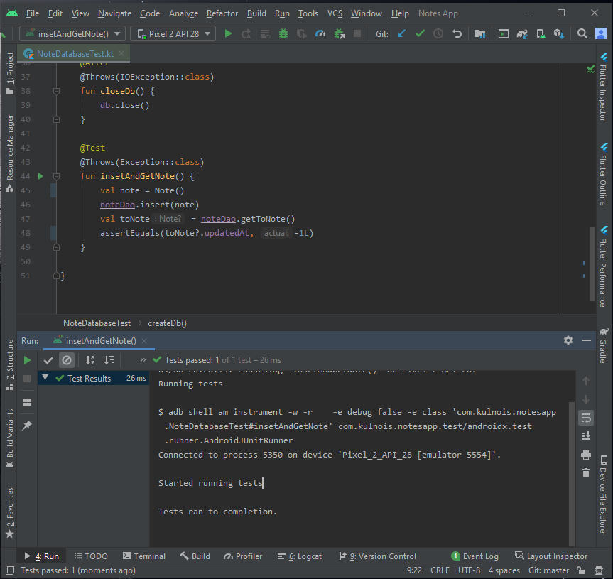
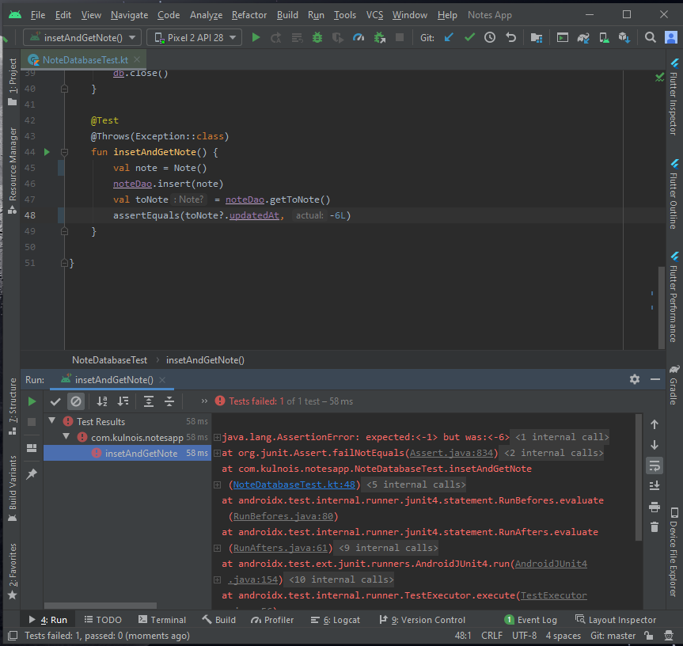

# [Notes App]


Proyecto de Android con Kotlin usando el patrón MVVM donde implemento algunas librerías de [Android Jetpack](https://developer.android.com/jetpack) 
como [Navigation](https://developer.android.com/jetpack/androidx/releases/navigation), [Databinding](https://developer.android.com/jetpack/androidx/releases/databinding), 
[Room](https://developer.android.com/jetpack/androidx/releases/room) y pruebas con [JUnit](https://developer.android.com/training/testing/junit-runner); 
para la creación de una aplicación sencilla donde se pueden crear, editar, eliminar y filtrar notas.

### Dependencias

- Kotlin
- Android KTX [version: '2.3.0'](https://developer.android.com/kotlin/ktx)
- Room [version: '2.2.5'](https://developer.android.com/jetpack/androidx/releases/room)
- Material [version: '1.2.0'](https://material.io/develop/android)
- JUnit [version: '4.12'](https://developer.android.com/training/testing/junit-runner)

### Arquitectura

Este proyecto esta basado en la arquitectura MVVM (Model View ViewModel), tambien uso el patrón `Repository Pattern`.



## Uso de ROOM

Para utilizar la librería en el proyecto tienen que agregar en el archivo `build.gradle` de tu modulo lo siguiente en `dependencies`:
```gradle
apply plugin: 'kotlin-kapt'

dependencies {
  ...
        // Room
        implementation "androidx.room:room-runtime:2.2.5"
        kapt "androidx.room:room-compiler:2.2.5"
  ...
}
```

### Creamos nuestra Entidad

Ahora procedemos a crear nuestro directorio `model` donde vamos a crear nuestro archivo Note una vez creado el archivo 
agregamos los atributos que tendra nuestro modelo como son `noteId`, `title`, `content`, `updatedAt`
```kt
    @Entity(tableName = "note_table")
    data class Note(
        @PrimaryKey(autoGenerate = true)
        var noteId: Long,
    
        @ColumnInfo(name = "title")
        var title: String,
    
        @ColumnInfo(name = "content")
        var content: String,
    
        @ColumnInfo(name = "updatedAt")
        var updatedAt: Long,
    ) {
        constructor() : this(0L, "", "", -1L)
    }
```
Veamos qué hacen estas anotaciones:

- `@Entity(tableName = "note_table")` El `@Entity` va a representar una tabla en SQLite. La cual para este caso le pasamos el nombre 
de la tabla si no queremos que se llame igual al modelo el cual nos queda `tableName = "note_table"` y nos indica que nuestra tabla se
llamara `note_table`.

- `@PrimaryKey(autoGenerate = true)` El `@PrimaryKey` indicamos que este valor sera nuestra clave primaria de la tabla y con `autoGenerate = true` ques este valor
 sera generado automáticamente.
 
- `@ColumnInfo(name = "content")` El `@ColumnInfo` especifica el nombre de la columna en la tabla y con `name = "content"` le damos un nombre
a dicho elemento el cual puede ser diferente a nuestro atributo del modelo.

Y por ultimo un constructor que nos creara un elemento para hacer pruebas mas adelante `constructor() : this(0L, "", "", -1L)` esta parte es opcional

### Creamos nuestra DAO

DAO (data access object) especifica consultas SQL y las asocia con llamadas a métodos. El cual debe ser una interfaz o una clase abstracta.

Ahora procedemos a crear nuestro directorio `database` donde vamos a crear nuestro `Dao` el cual llamaremos `NoteDatabaseDao` una vez creado el archivo 
agregamos nuestras consultas que SQL que sera insertar, actualizar, eliminar, listar por ID y listar todas.

```kt
    @Dao
    interface NoteDatabaseDao {    
        @Insert
        fun insert(note: Note)
    
        @Update
        fun update(note: Note)
    
        @Query("SELECT * FROM note_table ORDER BY noteId DESC")
        fun getAllNotes(): LiveData<List<Note>>
    
        @Query("SELECT * FROM note_table WHERE noteId = :key")
        fun get(key: Long): Note
    
        @Delete
        fun delete(note: Note)    
    }
```
Veamos qué hace esta interface:

- `@Dao` El `@Dao` identifica esto como una clase DAO para ROOM.
- `@Insert` El `@Insert` es una anotación de método DAO especial la cual no necesita proporcionar ninguún SQL para realizar 
la operacion de insertar datos (También tenemos @Delete y @Update para eliminar y actualizar filas).
- `@Query` El `@Query` requiere que se le pase una consulta SQL como parametro lo cual se usa para consultas 
complejas y otras operaciones como en este caso `@Query("SELECT * FROM note_table ORDER BY noteId DESC")`  le indicamos 
que queremos todos los datos y que los ordene de manera descendente y en este `@Query("SELECT * FROM note_table WHERE noteId = :key")` 
queremos que nos consulte una nota por id; para mas información [consultar](https://developer.android.com/training/data-storage/room/accessing-data.html).

### Creamos nuestra Database

Ahora procedemos a crear en nuestro directorio `database` el archivo `NoteDatabase`  una vez creado el archivo 
agregamos la información correspondiente.

```kt
    @Database(entities = [Note::class], version = 1, exportSchema = false)
    abstract class NoteDatabase : RoomDatabase() {
    
        abstract  val noteDatabaseDao: NoteDatabaseDao
    
        companion object {
            @Volatile
            private var INSTANCE: NoteDatabase? = null
    
            fun getInstance(context: Context) : NoteDatabase {
                synchronized(this) {
                    var instance = INSTANCE
                    if (instance == null) {
                        instance = Room.databaseBuilder(
                            context.applicationContext,
                            NoteDatabase::class.java,
                            "note_history_database"
                        )
                            .fallbackToDestructiveMigration()
                            .build()
    
                        INSTANCE = instance
                    }
                    return instance
                }
            }
        }
    }
```
Veamos qué temenos:

- Nuestra clase debe ser `abstract` y extender de `RoomDatabase`
- `@Database` Al `@Database` le agregamos las entidades que tendrá que en este caso es solo una `entities = [Note::class]` el cual recibe un array de las mismas,
 también le indicamos la versión que para este sera 1 `version = 1` y como no vamos a manejar migraciones dejamos `exportSchema` en 
 `false`.
- Implementamos singleton para evitar que se abran varias instancias de la base de datos al mismo tiempo el cual nos garantiza que siempre 
tenemos la misma instancia de la Database la cual la obtendremos de `getInstance`.

### Creamos nuestro Test

Ya para finalizar y comprobar que todo este funcionando creamos nuestro test procedemos a crear nuestro archivo `NoteDatabaseTest` 
en el directorio de nuestra app `androidTest`
```kt
    @RunWith(AndroidJUnit4::class)
    class NoteDatabaseTest {
        private lateinit var noteDao: NoteDatabaseDao
        private lateinit var db: NoteDatabase
    
        @Before
        fun createDb() {
            val context = InstrumentationRegistry.getInstrumentation().targetContext
            db = Room.inMemoryDatabaseBuilder(context, NoteDatabase::class.java)
                    .allowMainThreadQueries()
                    .build()
    
            noteDao = db.noteDatabaseDao
        }
    
        @After
        @Throws(IOException::class)
        fun closeDb() {
            db.close()
        }
    
        @Test
        @Throws(Exception::class)
        fun insetAndGetNote() {
            val note = Note()
            noteDao.insert(note)
            val toNote = noteDao.get(note.noteId)
            assertEquals(toNote?.updatedAt, -1L)
        }
    
    }
```

Veamos qué temenos:

- `@RunWith` El `@RunWith` nos indica que la prueba va a ser ejecutada con `JUnit 4`
- `@Before` En el `@Before` creamos un método para inicializar la base de datos
- `@After` En el `@After` creamos un método para limpiar la base de datos usando `db.close()`
- `@Test` En el `@Test` creamos un método de prueba donde vamos a insertar una nota y consultarla.

Si recordamos en nuestro constructor del modelo `Note` tenemos `constructor() : this(0L, "", "", -1L)` por eso no le pasamos valores 
cuando creamos la nota `val note = Note()` luego procedemos a insertarla en la base de datos con `noteDao.insert(note)` y luego con el 
`noteId` la consultamos `val toNote = noteDao.get(note.noteId)` y con el método de `junit` `assertEquals` comprobamos que la nota consultada
tenga el mismo valor en el `updatedAt` con el cual se creo `assertEquals(toNote?.updatedAt, -1L)` y corremos el test.



Resultado


Ahora procedemos a cambiar un valor en de `-1L` a `-6l` en `assertEquals(toNote?.updatedAt, -6L)` y corremos el test el cual no debe pasar

Resultado


Ya con esa comprobación  procedemos a implementar el patrón `Repository Pattern` y la creación de los `ViewModel` para alimentar nuestras vistas.

[App Release Dev Trivia APK](release/notes-app.apk)